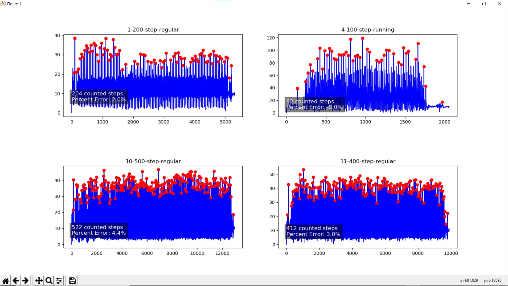

# Step_Counter_Project
- Developed a step counter using the csv data outputted from a phone’s accelerometer

- The step counter function analyzes:
  - difference between the maximums and minimums of acceleration data
  - magnitude of maximums of acceleration data

My program performed with an overall 2.5% error on regular walking and running data.

